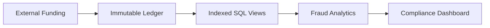

<div align="center">

# 💳 ApexLedger

### Immutable Financial Ledger & Fraud Analytics Engine

*A production-inspired FinTech database engineering project demonstrating immutable transaction processing, fraud detection, zero-trust data integrity, and enterprise-grade SQL architecture.*


</div>

---

# 📖 Overview

Most SQL projects stop at simple CRUD operations.

**ApexLedger** explores how modern financial institutions build **immutable ledger systems** capable of preserving complete transaction history while enabling high-performance reporting, fraud detection, and regulatory compliance.

Instead of updating balances directly, every financial event is permanently recorded, allowing historical balances to be reconstructed at any point in time.

This project demonstrates enterprise database engineering concepts commonly found in digital banking and payment platforms.

---

# ✨ Key Features

## 🔒 Immutable Transaction Ledger

- Append-only transaction model
- Complete audit trail
- Historical balance reconstruction
- No destructive updates

---

## ⚡ Fraud Analytics Engine

Detects suspicious financial activity using SQL analytics.

Examples include:

- Rapid peer-to-peer transfers
- High-frequency transactions
- Transaction velocity analysis
- Time-series anomaly detection

---

## 🛡 Zero-Trust Data Integrity

Financial integrity is enforced directly inside the database using:

- CHECK Constraints
- Foreign Keys
- NOT NULL Constraints
- Referential Integrity
- Restricted Deletes

Impossible balances are rejected before reaching the application.

---

## 📊 Reporting Layer

Production-ready analytical views provide:

- Historical Account Statements
- Wallet Balances
- Transaction Summaries
- Compliance Reports
- Fraud Dashboards

---

# 🏗 Architecture



---

# 🗄 Database Design

## Core Entities

| Table | Purpose |
|--------|----------|
| Accounts | Customer financial accounts |
| Wallets | Digital balance containers |
| Transactions | Immutable financial ledger |
| Fraud Logs | Compliance & fraud events |
| Customers | Identity & KYC information |

---

# 🚀 Engineering Highlights

### ✔ Immutable Ledger Architecture

Every transaction is permanently stored.

Historical balances are reproduced mathematically instead of relying on mutable balance columns.

---

### ✔ Enterprise Referential Integrity

Critical financial relationships are protected using explicit foreign key constraints and restricted deletes.

---

### ✔ Performance Optimization

Designed for high-volume financial systems.

Includes:

- Composite B-Tree Indexes
- Indexed Timestamp Queries
- Optimized Join Strategies
- Reduced Table Scans

---

### ✔ Fraud Detection Queries

Advanced SQL identifies:

- Transaction bursts
- Velocity attacks
- Suspicious money movement
- Abnormal transaction chains

---

### ✔ Historical Reporting

Uses SQL Views and Window Functions to generate:

- Running balances
- Historical statements
- Financial summaries
- Compliance reports

---

# 🛠 Technologies Used

| Layer | Technology |
|---------|------------|
| Database | MySQL 8.0 |
| Language | SQL |
| Indexing | B-Tree |
| Constraints | CHECK, FK |
| Analytics | Window Functions |
| Reporting | SQL Views |


# 📈 Project Metrics

| Metric | Value |
|----------|--------|
| Database | MySQL 8 |
| Core Tables | 5 |
| Analytical Views | Multiple |
| Constraints | Enterprise Grade |
| Fraud Engine | Included |
| Historical Ledger | Included |
| Dashboard | Included |

---

# 🎯 What This Project Demonstrates

✅ Advanced SQL

✅ Enterprise Database Design

✅ Immutable Ledger Systems

✅ Banking Data Architecture

✅ Fraud Detection

✅ Query Optimization

✅ Referential Integrity

✅ Analytical SQL

✅ Financial Reporting

---

# ⚙ Installation

Clone the repository

```bash
git clone https://github.com/yourusername/ApexLedger.git
```

Open **apex_ledger.sql** inside MySQL Workbench.

Execute the complete script.

The script automatically:

- Creates the database
- Builds all tables
- Applies constraints
- Creates indexes
- Generates analytical views
- Seeds production-style sample data

---

# 📊 Dashboard

The project automatically generates reporting datasets powering dashboards such as:

- 📈 Historical Balance Statements
- 🚨 Fraud Monitoring
- ⚡ Transaction Velocity
- 📊 Executive Performance Metrics

---

# 💡 Why ApexLedger?

The objective wasn't simply to build another SQL database.

The goal was to simulate the architecture used by modern financial platforms where data integrity, auditability, scalability, and regulatory compliance are critical requirements.

This project emphasizes engineering practices that extend beyond CRUD applications and reflects how production financial databases are designed.


<div align="center">

⭐ If you found this project interesting, consider giving it a star!

</div>
